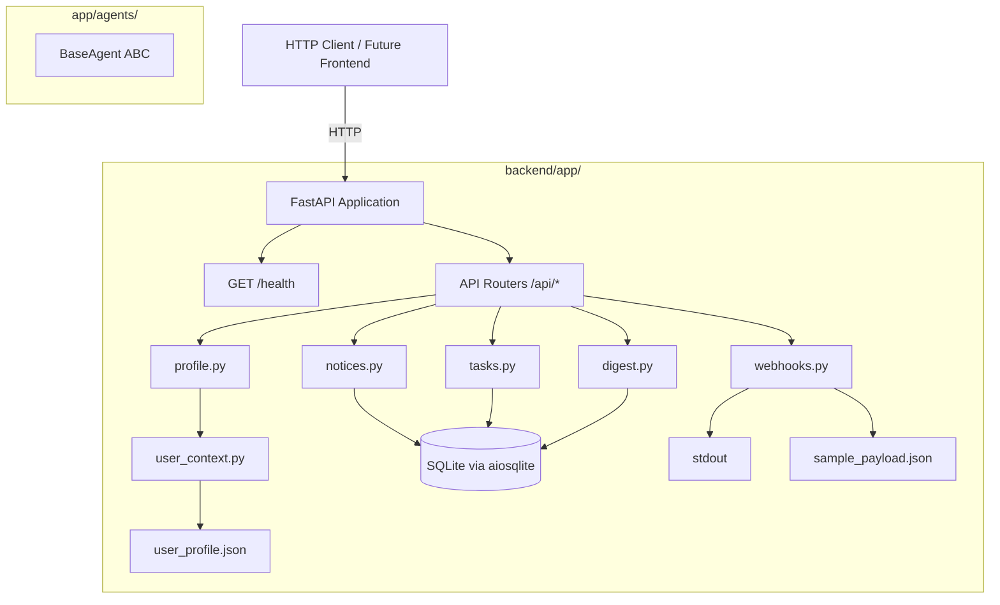

# Design Document: CampusFlow Phase 1

## Overview

CampusFlow Phase 1 establishes the backend skeleton for a campus assistant system. The design focuses on a lightweight, fully async FastAPI application backed by SQLite (via aiosqlite), using SQLModel for both ORM table definitions and Pydantic response serialization. The architecture is intentionally simple — no authentication, no business logic agents — just the structural foundation that future phases will build upon.

Key design goals:
- Zero external service dependencies (runs on a student laptop)
- Async-first with non-blocking database access
- Clear separation between routes, models, and utilities
- Extensible agent contract for future AI integration

## Architecture



The application follows a layered structure:
1. **Entry point** (`run.py`) — starts uvicorn with configurable host/port
2. **Application** (`main.py`) — creates the FastAPI app, adds CORS, mounts routers, defines /health
3. **Routers** — thin route handlers that call DB or utility functions
4. **Models** (`models.py`) — SQLModel table definitions that double as serialization schemas
5. **Database** (`database.py`) — async engine creation, session factory, table initialization
6. **Utilities** (`utils/`) — user context reader
7. **Agents** (`agents/base.py`) — abstract contract for future phases

## Components and Interfaces

### 1. FastAPI Application (`app/main.py`)

- Creates `FastAPI()` instance
- Adds `CORSMiddleware` with `allow_origins=["*"]`, `allow_methods=["*"]`, `allow_headers=["*"]`
- Defines `GET /health` returning `{"status": "healthy"}`
- Includes all routers with `/api` prefix
- Registers a `lifespan` async context manager that calls `init_db()` on startup

### 2. Database Layer (`app/database.py`)

- Creates async engine: `create_async_engine("sqlite+aiosqlite:///./campusflow.db")`
- Engine configuration must include an event listener to execute `PRAGMA foreign_keys=ON` upon connection to enforce referential integrity (SQLite disables FK constraints by default)
- Provides `async_session_maker` using `async_sessionmaker`
- Exposes `get_session()` async generator for FastAPI `Depends()`
- Exposes `init_db()` that runs `SQLModel.metadata.create_all()` via `engine.begin()`

### 3. Models (`app/models.py`)

All models use `SQLModel` with `table=True`:

| Model | Fields | Notes |
|-------|--------|-------|
| Notice | id, text_hash (unique), source_group, raw_text, parsed_title, category, is_processed, created_at | Base entity |
| Task | id, title, deadline, status, related_notice_id, is_conflict | FK → Notice.id (nullable), status enum |
| Event | id, title, start_time, end_time, location, related_notice_id | FK → Notice.id (nullable) |
| Digest | id, content, generated_at | Latest = max(generated_at) |

### 4. BaseAgent (`app/agents/base.py`)

```python
from abc import ABC, abstractmethod

class BaseAgent(ABC):
    @abstractmethod
    async def execute(self, payload: dict) -> dict:
        ...
```

- Cannot be instantiated directly (ABC)
- Subclasses must implement `execute` or get `TypeError`

### 5. User Context Utility (`app/utils/user_context.py`)

- Function `get_user_profile() -> dict` reads `user_profile.json` from the backend root
- Raises `FileNotFoundError` with descriptive message if file missing
- Raises `ValueError` with descriptive message if file is not valid JSON

### 6. Routers

| Router | Endpoint | Method | Response |
|--------|----------|--------|----------|
| profile | `/api/profile` | GET | User profile dict |
| notices | `/api/notices` | GET | List of all notices |
| tasks | `/api/tasks` | GET | List of all tasks |
| digest | `/api/digest/latest` | GET | Latest digest or "no digest" message |
| digest | `/api/digest/trigger` | POST | `{"status": "not implemented"}` |
| webhooks | `/api/webhooks/whatsapp` | POST | `{"status": "received"}` |

### 7. Entry Point (`run.py`)

```python
import uvicorn
if __name__ == "__main__":
    uvicorn.run("app.main:app", host="0.0.0.0", port=8000, reload=True)
```

## Data Models

### Notice

```python
class Notice(SQLModel, table=True):
    __tablename__ = "notices"
    id: int | None = Field(default=None, primary_key=True)
    text_hash: str = Field(unique=True, index=True)
    source_group: str
    raw_text: str
    parsed_title: str
    category: str
    is_processed: bool = Field(default=False)
    created_at: datetime = Field(default_factory=datetime.utcnow)
```

### Task

```python
class Task(SQLModel, table=True):
    __tablename__ = "tasks"
    id: int | None = Field(default=None, primary_key=True)
    title: str
    deadline: datetime
    status: str = Field(default="pending")  # "pending" | "completed"
    related_notice_id: int | None = Field(default=None, foreign_key="notices.id")
    is_conflict: bool = Field(default=False)
```

### Event

```python
class Event(SQLModel, table=True):
    __tablename__ = "events"
    id: int | None = Field(default=None, primary_key=True)
    title: str
    start_time: datetime
    end_time: datetime
    location: str
    related_notice_id: int | None = Field(default=None, foreign_key="notices.id")
```

### Digest

```python
class Digest(SQLModel, table=True):
    __tablename__ = "digests"
    id: int | None = Field(default=None, primary_key=True)
    content: str
    generated_at: datetime = Field(default_factory=datetime.utcnow)
```

### user_profile.json (static file)

```json
{
  "name": "Ankit",
  "branch": "Computer Science",
  "college": "Example University",
  "interests": ["AI", "web development", "competitive programming"],
  "current_focus": "Amazon Hackathon 2026 project"
}
```

## Correctness Properties

*A property is a characteristic or behavior that should hold true across all valid executions of a system — essentially, a formal statement about what the system should do. Properties serve as the bridge between human-readable specifications and machine-verifiable correctness guarantees.*

### Property 1: User profile JSON round-trip

*For any* valid Python dictionary containing the required profile fields (name, branch, college, interests, current_focus), writing it to `user_profile.json` and then calling `get_user_profile()` SHALL return a dictionary equal to the original.

**Validates: Requirements 4.1**

### Property 2: API list endpoint round-trip

*For any* set of Notice records inserted into the database, calling `GET /api/notices` SHALL return a JSON list containing all inserted records with field values matching the originals. The same property applies to Task records via `GET /api/tasks`.

**Validates: Requirements 5.2, 5.3**

### Property 3: Latest digest is most recent

*For any* non-empty set of Digest records with distinct `generated_at` timestamps inserted into the database, calling `GET /api/digest/latest` SHALL return the digest whose `generated_at` is the maximum among all inserted digests.

**Validates: Requirements 5.4**

### Property 4: Webhook accepts arbitrary JSON

*For any* valid JSON object, POSTing it to `POST /api/webhooks/whatsapp` SHALL return HTTP 200.

**Validates: Requirements 6.1**

## Error Handling

| Scenario | Behavior |
|----------|----------|
| `user_profile.json` missing | `get_user_profile()` raises `FileNotFoundError` with message indicating the file path |
| `user_profile.json` not valid JSON | `get_user_profile()` raises `ValueError` with message indicating parse failure |
| Database file inaccessible | SQLAlchemy raises `OperationalError` — unhandled in Phase 1 (acceptable for local dev) |
| Webhook receives non-JSON body | FastAPI returns 422 Unprocessable Entity (built-in validation) |
| Empty notices/tasks tables | Endpoints return empty list `[]` |
| Empty digests table | `/api/digest/latest` returns `{"message": "No digest available"}` with HTTP 200 |

## Testing Strategy

### Approach

**Dual testing approach:**
- **Unit/example tests**: Verify specific scenarios, edge cases, error conditions using `pytest` with `httpx.AsyncClient` (via `pytest-asyncio`)
- **Property tests**: Verify universal properties using `hypothesis` (Python PBT library) with minimum 100 iterations per property

### Test Framework Setup

- `pytest` + `pytest-asyncio` for async test support
- `httpx` for async HTTP client testing against FastAPI's `TestClient`
- `hypothesis` for property-based testing
- In-memory SQLite database for test isolation (`sqlite+aiosqlite:///:memory:`)

### Property Test Configuration

- Minimum 100 examples per property (`@settings(max_examples=100)`)
- Each property test tagged with: `# Feature: campusflow, Property N: <title>`
- Hypothesis strategies for generating:
  - Random profile dicts (st.fixed_dictionaries with appropriate types)
  - Random Notice/Task/Event records (st.builds with model constructors)
  - Random JSON payloads (st.recursive with primitives)

### Unit Test Coverage

- Health endpoint returns 200 with correct body
- CORS headers present on responses
- BaseAgent cannot be instantiated; incomplete subclass raises TypeError
- Model field validation (correct types, required fields)
- Foreign key constraints enforced
- Webhook file creation (first call) and non-overwrite (subsequent calls)
- Digest trigger returns stub response
- Error cases: missing profile file, empty tables

### Test File Structure

```
backend/
├── tests/
│   ├── __init__.py
│   ├── conftest.py          (fixtures: async client, test DB, cleanup)
│   ├── test_health.py
│   ├── test_agent.py
│   ├── test_models.py
│   ├── test_profile.py
│   ├── test_notices.py
│   ├── test_tasks.py
│   ├── test_digest.py
│   ├── test_webhooks.py
│   └── test_properties.py  (all property-based tests)
```
